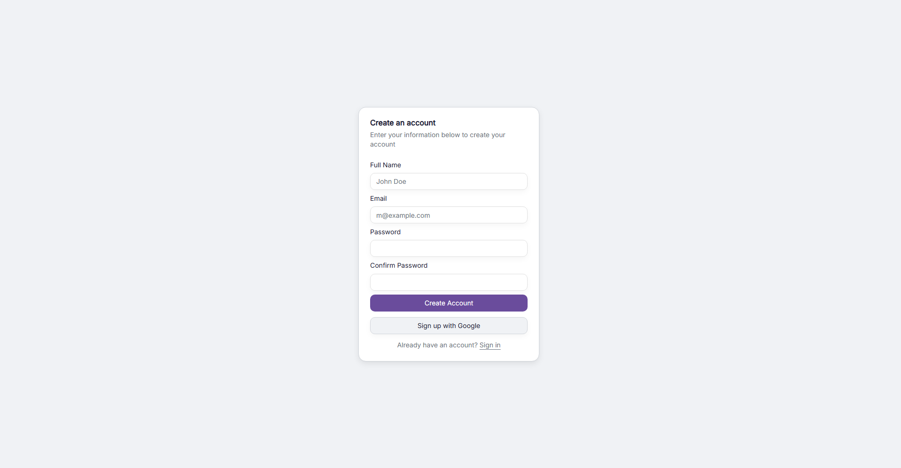
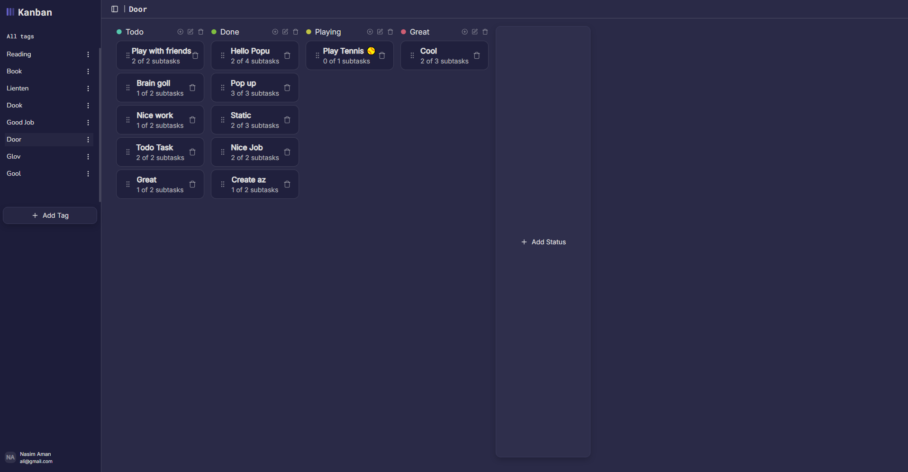
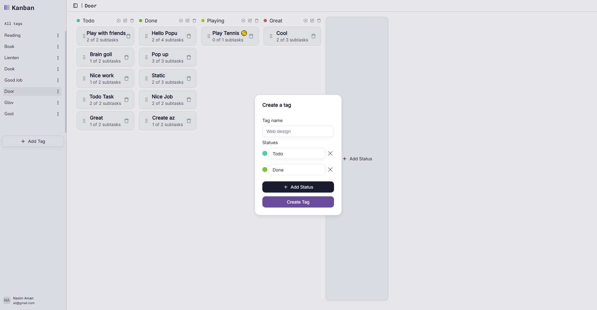
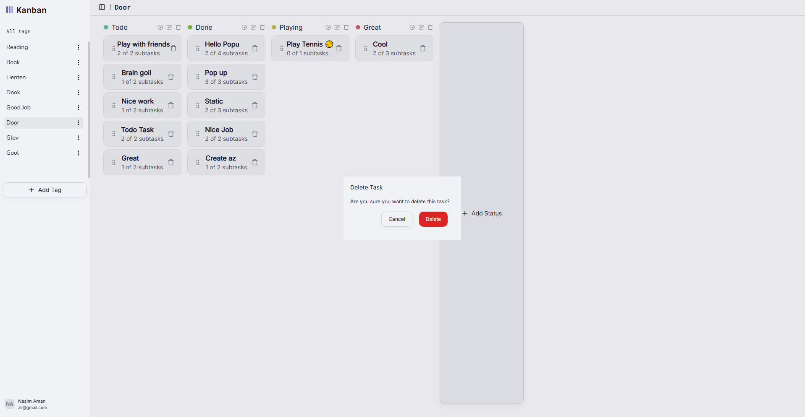

# Task Management Application

A full-stack task management application built with **React** and **Tailwind CSS** on the frontend, and **NestJS** with **Prisma** on the backend.  

Users can manage boards, tasks, and subtasks with an intuitive interface, toggle light/dark mode, and enjoy a responsive design optimized for all screen sizes.

---

## Features

- **CRUD Boards & Tasks:** Create, view, edit, and delete boards and tasks.
- **Subtasks:** Mark subtasks as complete.
- **Drag & Drop (Bonus):** Reorder tasks within columns and move them between columns.
- **Form Validation:** Ensure valid input when creating or editing boards and tasks.
- **Sidebar Toggle:** Hide or show the board sidebar.
- **Theme Toggle:** Switch between light and dark modes.
- **Responsive Layout:** Works smoothly on all devices.
- **Persistent Data:** Backend stores all changes so data persists across sessions.

---

## Backend

The backend is built with **NestJS** and handles all API requests for boards, tasks, and subtasks.  

Key technologies:
- NestJS (Node.js framework)
- Prisma ORM
- PostgreSQL 
- REST API endpoints for all CRUD operations

 

## Tech Stack

**Frontend:**
- React
- Tailwind CSS
- React Router
- React Hook Form (optional)

**Backend:**
- NestJS
- Node.js
- Prisma ORM
- PostgreSQL

The frontend communicates with the backend hosted here:  
[Kanban Task Backend](https://github.com/AslamtoIbrahim/kanban-task-backend)

---

## Screenshots

### Signup

### Dashboard

### Create New Task

### Delete Task

---

## Live Demo

Try the app online: [Task Management App Live Demo](https://dancing-longma-3d3bef.netlify.app)  
 
 
